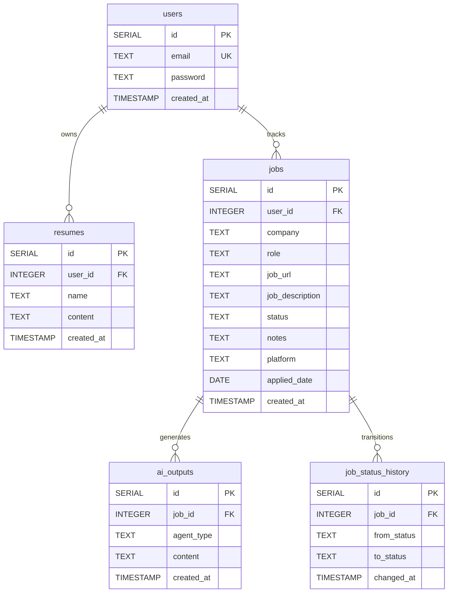

# 💼 AI Job Tracker - Backend API

An asynchronous, high-performance REST API built with **FastAPI** to power the AI Job Tracker platform. This backend handles user authentication, CRUD operations for job applications and resumes, automated resume-to-job matching, analytics calculations, and multi-agent AI features powered by OpenRouter.

---

## 🛠️ Tech Stack

- **Core Framework**: [FastAPI](https://fastapi.tiangolo.com/) (Python 3.12+)
- **Database Driver**: [asyncpg](https://github.com/MagicStack/asyncpg) (Asynchronous PostgreSQL client)
- **AI Integration**: [openai-agents](https://pypi.org/project/openai-agents/) (OpenAI Agents framework) & OpenRouter API
- **Auth & Security**: [pyjwt](https://pyjwt.readthedocs.io/) (JWT authentication) & [bcrypt](https://github.com/pyca/bcrypt/) (password hashing)
- **Dependency & Environment Management**: Managed via [uv](https://github.com/astral-sh/uv) and `pyproject.toml`
- **WSGI/ASGI Server**: [Uvicorn](https://www.uvicorn.org/)

---

## 📁 Project Structure

- [`main.py`](./main.py) - API entry point, CORS middleware config, API documentation setup, and startup bootstrap logic.
- [`pyproject.toml`](./pyproject.toml) - Python dependencies, runtime requirements, and project metadata.
- [`db/`](./db/) - Database layer.
  - [`db/database.py`](./db/database.py) - Connection pooling (`asyncpg`), connection manager, and automatic SQL DDL schema initialization.
  - [`db/auth_dep.py`](./db/auth_dep.py) - FastAPI dependency for JWT verification and session validation.
- [`routers/`](./routers/) - API Route controllers.
  - [`routers/auth.py`](./routers/auth.py) - User registration, credentials login, and profile info retrieval endpoints.
  - [`routers/jobs.py`](./routers/jobs.py) - Job tracking CRUD endpoints, status history tracking, and details aggregator.
  - [`routers/resumes.py`](./routers/resumes.py) - Resume document storage CRUD endpoints.
  - [`routers/ai.py`](./routers/ai.py) - Tailored resume selector, one-shot agent execution, and interactive agent chat sessions.
  - [`routers/analytics.py`](./routers/analytics.py) - Funnel aggregations, conversion rates, 8-week application timeline, and stage duration statistics.
- [`custom_agents/`](./custom_agents/) - AI Agent layer.
  - [`custom_agents/ai_agents.py`](./custom_agents/ai_agents.py) - Definitions for the Resume Scorer, Cover Letter Generator, and Interview Prep agents using `openai-agents`.
- [`utils/`](./utils/) - Helper utilities.
  - [`utils/resume_selector.py`](./utils/resume_selector.py) - Automatic resume selector using token-overlap/set-intersection metrics.
- [`scratch_db.py`](./scratch_db.py) - CLI script to count active database table rows.
- [`scratch_drop_tables.py`](./scratch_drop_tables.py) - CLI script to wipe/reset database tables for testing.

---

## 🗄️ Database Schema

The database is built on **PostgreSQL** and initializes automatically on backend startup. It includes the following tables:



- **`users`**: Stores login credentials (securely hashed via `bcrypt`) and emails.
- **`resumes`**: Stores resumes created or uploaded by users (contains raw text contents).
- **`jobs`**: Tracks applications. The status is restricted to `Saved`, `Applied`, `Interview`, `Offer`, or `Rejected`.
- **`ai_outputs`**: Caches generated agent evaluations (resume scores, tailored cover letters, or interview preps) for quick subsequent retrieval.
- **`job_status_history`**: Automatically tracks status transitions whenever a job is updated to build analytics metrics.

---

## 🤖 AI Agents & Utilities

The backend features dedicated AI Agents configured to call model inference via **OpenRouter**:

1. **Resume Scorer (`scorer`)**: Acts as a professional recruiter. Scrutinizes the candidate's resume against a job description, returning a structured JSON containing a numerical score (0-100), overall assessment, list of strengths/improvements, and missing keywords.
2. **Cover Letter Generator (`cover_letter`)**: Acts as a career coach. Automatically compiles a tailored 3-4 paragraph (under 350 words) cover letter without placeholders, and supports refinements via direct chat messages.
3. **Interview Prep (`interview_prep`)**: Generates 6 specific interview questions (technical, behavioral, or situational) and provides answer-guidance tips in a structured JSON schema, with support for sample-answers requests in chat mode.

### 🔍 Auto-Resume Selector
If no specific resume ID is supplied when requesting an AI execution, the system evaluates all the user's resumes against the target job description using an overlap calculation (tokenizing text, excluding common stopwords, and finding the size of the set intersection). The resume with the highest score is automatically selected.

---

## 🚀 Getting Started

### 📋 Prerequisites
- **Python 3.12+**
- **PostgreSQL** instance (local, Docker, or managed cloud like Neon)
- **OpenRouter API Key** for LLM access

### ⚙️ Environment Configuration
Create a `.env` file in the root of the `backend/` directory:

```env
DATABASE_URL=postgresql://<username>:<password>@<host>:<port>/<dbname>?sslmode=require
SECRET_KEY=your-jwt-signing-secret-key
OPENROUTER_API_KEY=your-openrouter-api-key
OPENROUTER_MODEL=google/gemma-4-31b-it:free # Or any preferred OpenRouter model identifier
```

### 📥 Setup Dependencies
We recommend using the fast package manager `uv`:

```bash
# Install uv if you don't have it
pip install uv

# Create a virtual environment
uv venv

# Activate venv (Windows PowerShell)
.venv\Scripts\Activate.ps1

# Activate venv (Linux/macOS)
source .venv/bin/activate

# Install dependencies from pyproject.toml
uv pip install -e .
```

### 🏃 Running the API Server
Start the development server with hot-reload enabled:

```bash
uv run uvicorn main:app --reload
```

The application will bootstrap, initialize required tables, and start listening on [http://localhost:8000](http://localhost:8000).

- **Swagger Documentation**: [http://localhost:8000/docs](http://localhost:8000/docs)
- **ReDoc Documentation**: [http://localhost:8000/redoc](http://localhost:8000/redoc)

---

## 🔗 API Endpoint Catalog

| Tag | Method | Route | Description | Auth Required |
| :--- | :--- | :--- | :--- | :---: |
| **Auth** | `POST` | `/auth/register` | Register a new user account & return JWT token | ❌ |
| | `POST` | `/auth/login` | Log in with credentials & return JWT token | ❌ |
| | `GET` | `/auth/me` | Fetch profile information of current logged-in user | `Bearer` |
| **Jobs** | `GET` | `/jobs/` | List all tracked jobs for the current user | `Bearer` |
| | `POST` | `/jobs/` | Add a new job application | `Bearer` |
| | `GET` | `/jobs/{job_id}` | Retrieve specific job details, status history, & cached AI reports | `Bearer` |
| | `PUT` | `/jobs/{job_id}` | Update job fields (notes, details, status) and log stage transitions | `Bearer` |
| | `DELETE` | `/jobs/{job_id}` | Delete a job application (cascades database details) | `Bearer` |
| **Resumes** | `GET` | `/resumes/` | List resume names (excluding content for efficiency) | `Bearer` |
| | `GET` | `/resumes/{resume_id}`| Get full resume contents | `Bearer` |
| | `POST` | `/resumes/` | Save a new resume | `Bearer` |
| | `PUT` | `/resumes/{resume_id}`| Update resume name or body | `Bearer` |
| | `DELETE` | `/resumes/{resume_id}`| Permanently delete a resume | `Bearer` |
| **AI** | `POST` | `/ai/run-agent` | Execute an agent (scorer, cover_letter, interview_prep) with auto-selected resume | `Bearer` |
| | `POST` | `/ai/chat` | Continue a conversation with an agent for a specific job context | `Bearer` |
| | `GET` | `/ai/outputs` | List all generated AI reports and summaries | `Bearer` |
| **Analytics**| `GET` | `/analytics/summary` | Retrieve application metrics, conversion funnel, and transition rates | `Bearer` |
